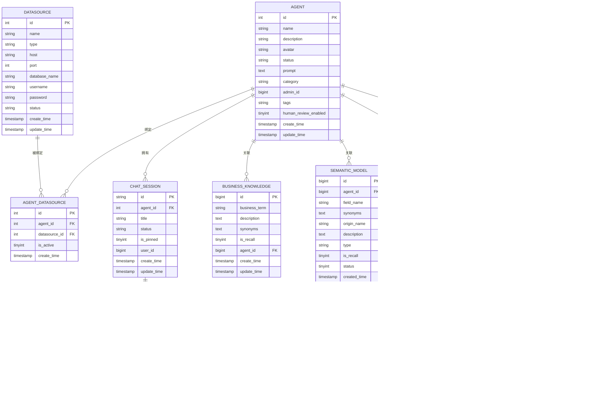

# Spring AI Alibaba DataAgent 架构图

本文档包含 DataAgent 项目的各类架构图和流程图。

---

## 1. 系统整体架构图


---

## 2. Graph 工作流完整流程图


---

## 3. NL2SQL 核心流程时序图


---

## 4. 数据库 ER 图



---

## 5. 模块依赖关系图


---

## 6. Graph 节点状态流转图


---

## 7. 前端页面路由图

```mermaid
graph TD
    A[/] --> B[/agents<br/>智能体列表]
    B --> C[/agents/create<br/>创建智能体]
    B --> D[/agents/:id<br/>智能体详情]
    D --> E[/agents/:id/run<br/>对话交互]
    
    style B fill:#e1f5ff
    style C fill:#fff3e0
    style D fill:#f3e5f5
    style E fill:#e8f5e9
```

---

**文档版本**: v1.0  
**最后更新**: 2025-11-06

